# IBM TechXchange 2023 - Unleash the Power of Hybrid Multi-Cloud Applications with IBM Cloud Satellite [3670]

Embracing a hybrid multi-cloud architecture can be transformative for businesses. It offers a flexible and secure way to handle IT infrastructure, optimize costs, and ensure maximum uptime. Meet IBM Cloud Satellite, your partner in running workloads across multiple environments — be it private or public clouds or on-premises. Ready to dive into a hands-on session with IBM Cloud Satellite? Join us to learn how you can securely and efficiently expose your applications running on multi-cloud infrastructure.

**Session Type:** Hands-on Lab\
**Tech Tracks:** Hybrid Cloud\
**Session Topic:** Hybrid Cloud Software\
**Industry:** Cross Industry\
**Technical Level:** Intermediate Level

**Instructors:**

- Attila Fábián, Lead Software Engineer, IBM
- Attila Szűcs, Software Engineer, IBM

**Coordinates:**

- Monday, Sep 11 5:00 PM - 6:30 PM PDT
- Boulevard 159, Level 1

[>> See this session on the conference page <<](https://www.ibm.com/community/ibm-techxchange-catalog/?search=3670#/)

## Lab objectives

- Get familiar with [IBM Cloud Satellite](https://cloud.ibm.com/docs/satellite?topic=satellite-getting-started).
- Learn how to deploy applications with [Satellite Config](https://cloud.ibm.com/docs/satellite?topic=satellite-cluster-config).
- Explore ways to expose applications running on your Satellite location.
- Learn about [IBM Cloud Secrets Manager](https://www.ibm.com/cloud/secrets-manager) for secret management.

## Lab architecture

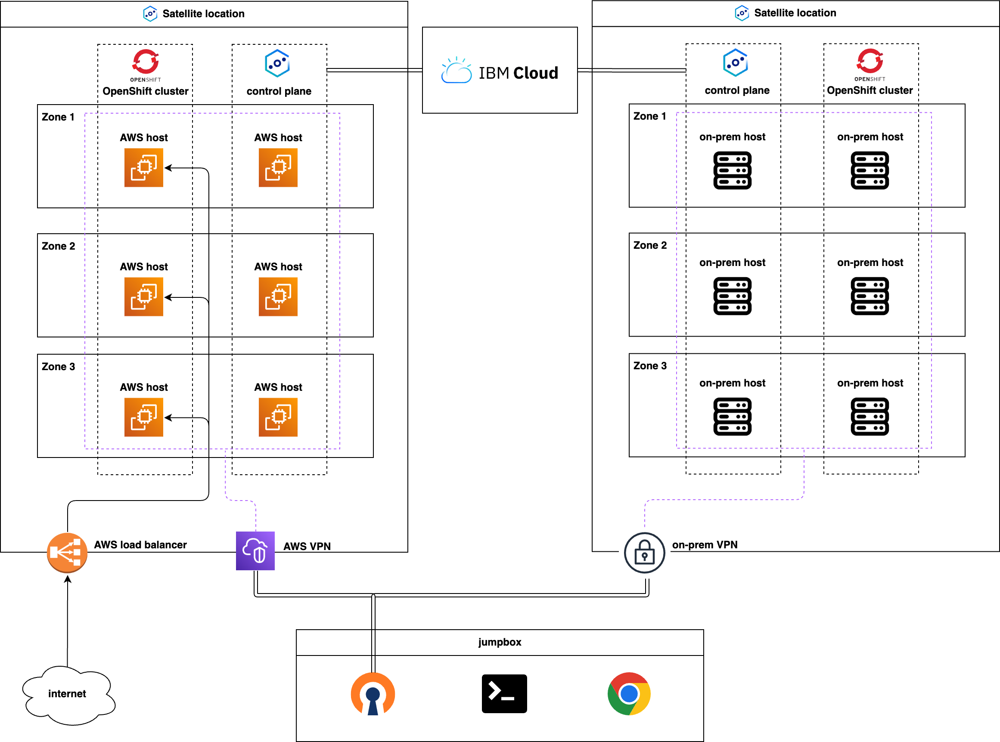

Your lab environment consist of the following components:

- Satellite location running on AWS (multi-cloud use case):
    - runs with 6 hosts (3 hosts are assigned to the location control plane, 3 hosts are used as OpenShift workers)
- OpenShift cluster running on AWS Satellite location:
    - workers are exposed publicly with an AWS load balancer
- On-premises Satellite location (hybrid-cloud use case):
    - runs with 6 hosts (3 hosts are assigned to the location control plane, 3 hosts are used as OpenShift workers)
- OpenShift cluster running on on-premises Satellite location
- Jumpbox:
    - connects to the AWS VPC and to the on-premises infrastructure with VPN

## Task 0: Find your attendee number

In the lab system, you can find an e-mail address and a password assigned to you. You can use this credential to log in to [IBM Cloud](https://cloud.ibm.com/login).

The e-mail address is specified in the following format:

```
Attila.Szucs7+XX@mail.test.ibm.com
```

`XX` is your attendee number. Make a note of it. It will be used multiple times throughout the lab.

## Task 1: Get familiar with your lab environment

In this task, you are going to learn about the architecture of your lab environment and learn the basic commands for IBM Cloud Satellite and Red Hat OpenShift on IBM Cloud.

### Open your jumpbox

In the lab system, click the "Launch Lab" button.

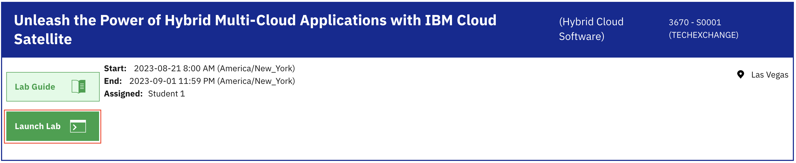

On the following page, you will see one virtual machine, that is your jumpbox. Click the Red Hat icon on the screen to connect.


At this point you should be connected to the jumpbox.

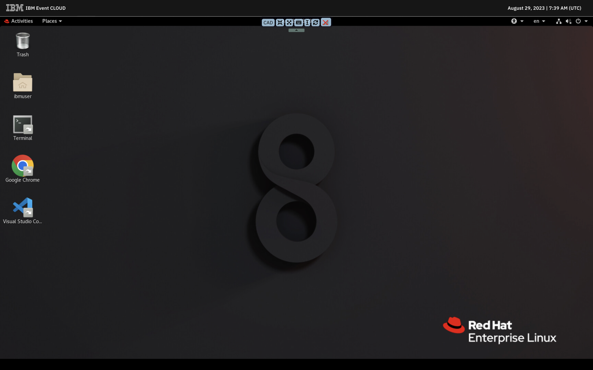

### Login to the IBM Cloud account using CLI

The jumpbox has [IBM Cloud CLI](https://cloud.ibm.com/docs/cli?topic=cli-getting-started) preinstalled. To log in to the IBM Cloud account, open the terminal and execute the following command:

```bash
ibmcloud login --apikey "${IBMCLOUD_API_KEY}" -r us-east
```

<details>
<summary>Example output</summary>

```
API endpoint: https://cloud.ibm.com
Authenticating...
OK

Targeted account itztsglenablement204 (e54e9ad3662840dfa0293e1dac9df761) <-> 2579262

Targeted region us-east


API endpoint:      https://cloud.ibm.com
Region:            us-east
User:              Attila.Szucs7@ibm.com
Account:           itztsglenablement204 (e54e9ad3662840dfa0293e1dac9df761) <-> 2579262
Resource group:    No resource group targeted, use 'ibmcloud target -g RESOURCE_GROUP'
CF API endpoint:
Org:
Space:
```

</details>

(Note: the `IBMCLOUD_API_KEY` environment variable contains an API key pregenerated for your lab user.)

### Inspect Satellite locations

To list Satellite locations, use the following command:

```bash
ibmcloud sat location ls
```

<details>
<summary>Example output</summary>

```
Retrieving locations...
OK
Name                  ID                     Status   Ready   Created        Hosts (used/total)   Managed From
aws-location-XX       cjmvtshw0at4soomhl00   normal   yes     21 hours ago   4 / 6                wdc
on-prem-location-XX   cjn08upw04m4qsamrthg   normal   yes     21 hours ago   6 / 6                wdc
```

</details>

You should see two Satellite locations: `aws-location-XX` runs on AWS hosts, while `on-prem-location-XX` runs on on-premises hosts.

To see the details and status of a Satellite location, you can use the following command:

```bash
ibmcloud sat location get --location aws-location-XX
```

<details>
<summary>Example output</summary>

```
Retrieving location...
OK

Name:                                     aws-location-XX
ID:                                       cjmvtshw0at4soomhl00
Created:                                  2023-08-29 16:21:38 +0200 (21 hours ago)
Managed From:                             wdc
State:                                    normal
Ready for deployments:                    yes
Message:                                  R0001: The Satellite location is ready for operations.
Pod subnet:                               172.16.0.0/16
Service subnet:                           172.20.0.0/16
Hosts Available:                          2
Hosts Total:                              6
Host Zones:                               us-east-1a, us-east-1b, us-east-1c
Provider:                                 -
Provider Region:                          -
Provider Credentials:                     no
Public Service Endpoint URL:              https://c107.us-east.satellite.cloud.ibm.com:32219
Private Service Endpoint URL:             -
OpenVPN Server Port:                      -
Ignition Server Port:                     -
Konnectivity Server Port:                 30881
Logging Key Set:                          no
Activity Tracker Key Set:                 no
Pod network interface selection method:   -
```

</details>

Hosts that have [sufficient compute, storage and network](https://cloud.ibm.com/docs/satellite?topic=satellite-host-reqs) can be [attached to a Satellite location](https://cloud.ibm.com/docs/satellite?topic=satellite-attach-hosts) by executing an attach script on the target machine. Once a machine is attached to a location, it can be assigned to run workloads. Each location must have at least 3 machines assigned to run the control plane.

To list hosts attached to a Satellite location, you can use:

```bash
ibmcloud sat host ls --location aws-location-XX
```

<details>
<summary>Example output</summary>

```
Retrieving hosts...
OK
Name               ID                     State        Status   Zone         Cluster              Worker ID                                                 Worker IP
ip-10-101-189-51   affa086f5ab748fc3f03   assigned     Ready    us-east-1c   infrastructure       sat-ip10101189-cba8e650ce7087939f4ee4d20f92573d982caa51   10.101.189.51
ip-10-101-189-58   1ee6da45821d4734c43f   unassigned   Ready    us-east-1c   -                    -                                                         -
ip-10-101-45-238   952758eef745ae5ef8ec   assigned     Ready    us-east-1a   public-services-01   sat-ip10101452-12154c4a2050a4fc7ad660c3cc2c1470da2b38f7   10.101.45.238
ip-10-101-51-202   699723991aef123ede21   assigned     Ready    us-east-1a   infrastructure       sat-ip10101512-d3e9119843c9f71835583840b54b160c4af5e24a   10.101.51.202
ip-10-101-77-68    47b4b3057641f3a21cb1   assigned     Ready    us-east-1b   infrastructure       sat-ip10101776-f4046769d74e1643e55d509de3783612e6118ce6   10.101.77.68
ip-10-101-81-73    1e507db2359197562506   unassigned   Ready    us-east-1b   -                    -                                                         -
```

</details>

#### Quiz

How many hosts does the `aws-location-XX` have and in what state?

<details>
<summary>6 hosts in total: 3 assigned to the Satellite control plane (<code>infrastructure</code>), 3 assigned to an OpenShift cluster (<code>public-services-XX</code>)</summary>
Not exactly. Run the <code>ibmcloud sat hosts ls --location aws-location-XX</code> and inspect the "State" and "Cluster" columns in the output.
</details>
<details>
<summary>6 hosts in total: 3 assigned to the Satellite control plane (<code>infrastructure</code>), 3 unassigned</summary>
Not exactly. Run the <code>ibmcloud sat hosts ls --location aws-location</code> and inspect the "State" and "Cluster" columns in the output.
</details>
<details>
<summary>6 hosts in total: 3 assigned to the Satellite control plane (<code>infrastructure</code>), 1 assigned to an OpenShift cluster (<code>public-services-XX</code>), 2 unassigned</summary>
That is correct! :star2:
</details>

### Inspect OpenShift clusters

To list clusters, use the following command:

```bash
ibmcloud oc cluster ls
```

<details>
<summary>Example output</summary>

```
OK
Name                 ID                     State    Created        Workers   Location              Version                  Resource Group Name   Provider
intranet-XX          cjn0s0mw0qj9takgqf40   normal   21 hours ago   3         on-prem-location-XX   4.12.24_1552_openshift   3670-lab-XX           satellite
public-services-XX   cjn0gvaw0gqg0kkgqf3g   normal   21 hours ago   1         aws-location-XX       4.12.24_1552_openshift   3670-lab-XX           satellite
```

</details>

You should see 2 OpenShift clusters: `intranet-XX` and `public-services-XX`. Check the "Location" column in the output. Verify that the `intranet-XX` cluster is deployed onto the `on-prem-location-XX` Satellite location, while the `public-services-XX` cluster is deployed onto `aws-location-XX`. [Creating OpenShift clusters on Satellite locations](https://cloud.ibm.com/docs/openshift?topic=openshift-satellite-clusters) is very similar to creating clusters on IBM Cloud infrastructure. The only significant difference is that you need to select a target Satellite location instead of an IBM Cloud datacenter or VPC.

To see the details and status of a cluster, you can use the following command:

```bash
ibmcloud oc cluster get --cluster intranet-XX
```

<details>
<summary>Example output</summary>

```
Retrieving cluster intranet-XX...
OK

Name:                                     intranet-XX
ID:                                       cjn0s0mw0qj9takgqf40
State:                                    normal
Status:                                   All Workers Normal
Created:                                  2023-08-29 17:25:54 +0200 (21 hours ago)
Resource Group ID:                        5b0abcb5b3784498a534713cf6274ffb
Resource Group Name:                      3670-lab-01
Pod Subnet:                               172.30.0.0/16
Service Subnet:                           172.21.0.0/16
Workers:                                  3
Worker Zones:                             us-east-1, us-east-2, us-east-3
Ingress Subdomain:                        intranet-XX-e43ebe1e9ac7c5f7ba5fce9d3d1e6c08-0000.us-east.containers.appdomain.cloud
Ingress Secret:                           intranet-XX-e43ebe1e9ac7c5f7ba5fce9d3d1e6c08-0000
Ingress Status:                           healthy
Ingress Message:                          All Ingress components are healthy.
Public Service Endpoint URL:              https://c-01.private.us-east.link.satellite.cloud.ibm.com:33560
Private Service Endpoint URL:             https://oc4c81768101b964fdd9a-6b64a6ccc9c596bf59a86625d8fa2202-ce00.us-east.satellite.appdomain.cloud:30229
Pull Secrets:                             enabled in the default namespace
VPCs:                                     -
VPE:                                      -
Pod network interface selection method:   -
Infrastructure topology:                  highly-available

Master
Status:     Ready (21 hours ago)
State:      deployed
Health:     normal
Version:    4.12.24_1552_openshift
Location:   on-prem-location-01
URL:        https://oc4c81768101b964fdd9a-6b64a6ccc9c596bf59a86625d8fa2202-ce00.us-east.satellite.appdomain.cloud:30229
```

</details>

To fetch the Kubernetes configuration files for a cluster, you can use the following command:

```bash
ibmcloud oc cluster config --admin --cluster intranet-XX
```

<details>
<summary>Example output</summary>

```
OK
The configuration for cjn0s0mw0qj9takgqf40 was downloaded successfully.

Added context for cjn0s0mw0qj9takgqf40 to the current kubeconfig file.
You can now execute 'kubectl' commands against your cluster. For example, run 'kubectl get nodes'.
```

</details>

At this point you should be able to execute `kubectl` or `oc` commands, for example:

```bash
oc get nodes
```

<details>
<summary>Example output</summary>

```
NAME                      STATUS   ROLES           AGE   VERSION
techxchange-3670-host-3   Ready    master,worker   23h   v1.25.11+1485cc9
techxchange-3670-host-4   Ready    master,worker   23h   v1.25.11+1485cc9
techxchange-3670-host-5   Ready    master,worker   23h   v1.25.11+1485cc9
```

</details>

#### Quiz

How many nodes does the `public-services-XX` cluster have?

<details>
<summary>3</summary>
Not exactly. Fetch the Kubernetes configuration files using the <code>ibmcloud oc cluster config --cluster public-services-XX --admin</code> command and then list the nodes with the <code>oc get nodes</code> command.
</details>
<details>
<summary>1</summary>
That is correct! :star2:
</details>
<details>
<summary>6</summary>
Not exactly. Fetch the Kubernetes configuration files using the <code>ibmcloud oc cluster config --cluster public-services-XX --admin</code> command and then list the nodes with the <code>oc get nodes</code> command.
</details>

## Task 2: Deploy and expose public company website

In this task, you are going to deploy the public website of _TechXchange Co._ (our imaginary company) and add zones to a single-zone OpenShift cluster (`public-services-XX`) deployed on a multi-cloud location (`aws-location-XX`). You will learn how to expose the app locally on your machine for debugging purposes and how to expose the application publicly through a custom domain.

### Deploy company website

First, fetch the Kubernetes configuration files for the `public-services-XX` cluster:

```bash
ibmcloud oc cluster config --cluster public-services-XX --admin
```

<details>
<summary>Example output</summary>

```
OK
The configuration for cjn0gvaw0gqg0kkgqf3g was downloaded successfully.

Added context for cjn0gvaw0gqg0kkgqf3g to the current kubeconfig file.
You can now execute 'kubectl' commands against your cluster. For example, run 'kubectl get nodes'.
```

</details>

The declarative configuration of the company website is already prepared ([here](https://github.com/attiss/ibm-techxchange-2023-3670/blob/main/applications/public-website.yaml)). You just need to apply:

```bash
oc apply -f https://raw.githubusercontent.com/attiss/ibm-techxchange-2023-3670/main/applications/public-website.yaml
```

<details>
<summary>Example output</summary>

```
namespace/public-website created
deployment.apps/public-website created
service/public-website created
```

</details>

Let's check if the pods are running as expected:

```bash
oc get pods -n public-website
```

<details>
<summary>Example output</summary>

```
NAME                              READY   STATUS    RESTARTS   AGE
public-website-58c49f5f5d-2vl98   1/1     Running   0          18s
public-website-58c49f5f5d-78dcg   0/1     Pending   0          18s
public-website-58c49f5f5d-gkw77   0/1     Pending   0          18s
```

</details>

Looks like the website is configured to run 2 replicas, but only 1 of them is running. This is because the deployment has [pod anti-affinity](https://kubernetes.io/docs/concepts/scheduling-eviction/assign-pod-node/#inter-pod-affinity-and-anti-affinity) configuration to ensure all pods are running on different nodes, but our cluster has only 1 node. Such an anti-affinity configuration helps increasing the resiliency of the application. If 1 of the node goes down, only 1 of the pods will become unavailable and the other 2 will keep running and serving requests.

#### Quiz

Which command can you use to determine the cause of the "Pending" pod state?

<details>
<summary><code>oc describe pod -n public-website public-website-..........-.....</code></summary>
That is correct! :star2:

If you execute the command, you should see a similar message appearing in the "Events" section:

```
Events:
  Type     Reason            Age                From               Message
  ----     ------            ----               ----               -------
  Warning  FailedScheduling  16s (x8 over 14m)  default-scheduler  0/1 nodes are available: 1 node(s) didn't match pod anti-affinity rules. preemption: 0/1 nodes are available: 1 No preemption victims found for incoming pod.
```

</details>
<details>
<summary><code>oc get nodes</code></summary>
Not exactly. This command lists the cluster nodes, but does not provide the exact cause why the pod could not be scheduled.
</details>

### Add zones to the single-zone `public-services-XX` cluster

Single-node clusters might be a good option if you want to reduce costs or want to simplify the management. However, if resiliency, workload isolation and security are important factors, then a multi-node setup is more suitable. 

As we already concluded earlier, the Satellite location where the `public-services-XX` cluster is deployed has 2 unassigned hosts. To automatically assign these hosts to the cluster, we are going to configure additional zones for the worker pool of the cluster.

To see the details of the default worker pool, execute the following command:

```bash
ibmcloud oc worker-pool get --cluster public-services-XX --worker-pool default
```

<details>
<summary>Example output</summary>

```
Retrieving worker pool default from cluster public-services-XX...
OK

Name:               default
ID:                 cjn0gvaw0gqg0kkgqf3g-8ed8119
State:              active
Hardware:           shared
Operating System:   REDHAT_8_64
VPC:                -
Flavor:             upi
Host Labels:        env=prod,os=RHEL8
Labels:             ibm-cloud.kubernetes.io/worker-pool-id=cjn0gvaw0gqg0kkgqf3g-8ed8119
Workers per Zone:   1
Total Workers:      1

Zones
Zone         Workers   Subnets
us-east-1a   1         subnet-upi
```

</details>

The worker pool currently has only 1 zone configured (`us-east-1a`). If you add new zones to your worker pool, hosts that belong to that zone will get automatically assigned as they match the labels of the worker pool.

Run the following commands to add the `us-east-1b` and `us-east-1c` zones:

```bash
ibmcloud oc zone add satellite --cluster public-services-XX --zone us-east-1b --worker-pool default
```

<details>
<summary>Example output</summary>

```
OK
```

</details>

```bash
ibmcloud oc zone add satellite --cluster public-services-XX --zone us-east-1c --worker-pool default
```

<details>
<summary>Example output</summary>

```
OK
```

</details>

That was easy. Let's see the host assignments now:

```bash
ibmcloud sat host ls --location aws-location-XX
```

<details>
<summary>Example output</summary>

```
Retrieving hosts...
OK
Name               ID                     State      Status   Zone         Cluster              Worker ID                                                 Worker IP
ip-10-101-189-51   affa086f5ab748fc3f03   assigned   Ready    us-east-1c   infrastructure       sat-ip10101189-cba8e650ce7087939f4ee4d20f92573d982caa51   10.101.189.51
ip-10-101-189-58   1ee6da45821d4734c43f   assigned   Ready    us-east-1c   public-services-XX   sat-ip10101189-93e38f7b54843630c3154699cba9c19b4e802485   10.101.189.58
ip-10-101-45-238   952758eef745ae5ef8ec   assigned   Ready    us-east-1a   public-services-XX   sat-ip10101452-12154c4a2050a4fc7ad660c3cc2c1470da2b38f7   10.101.45.238
ip-10-101-51-202   699723991aef123ede21   assigned   Ready    us-east-1a   infrastructure       sat-ip10101512-d3e9119843c9f71835583840b54b160c4af5e24a   10.101.51.202
ip-10-101-77-68    47b4b3057641f3a21cb1   assigned   Ready    us-east-1b   infrastructure       sat-ip10101776-f4046769d74e1643e55d509de3783612e6118ce6   10.101.77.68
ip-10-101-81-73    1e507db2359197562506   assigned   Ready    us-east-1b   public-services-XX   sat-ip10101817-3a851bca9528391d038e6666a1ee8653d719a04c   10.101.81.73
```

</details>

Now all the location hosts are assigned and the `public-services-XX` has 1 host in each of the zones (`us-east-1a`, `us-east-1b`, `us-east-1c`). It will take 10-15 minutes for the nodes to be fully ready. **You do not need to wait for the nodes to be provisioned to continue the lab tasks. We suggest to proceed with the next task and check back later if you have enough time.**

Once the provisioning is completed, you can see the nodes appearing:

```bash
oc get node
```

<details>
<summary>Example output</summary>

```
NAME                            STATUS   ROLES           AGE   VERSION
ip-10-101-189-58.ec2.internal   Ready    master,worker   48m   v1.25.11+1485cc9
ip-10-101-45-238.ec2.internal   Ready    master,worker   30h   v1.25.11+1485cc9
ip-10-101-81-73.ec2.internal    Ready    master,worker   47m   v1.25.11+1485cc9
```

</details>

With sufficient number of nodes, the pods of our public website are running as expected:

```bash
oc get pods -n public-website
```

<details>
<summary>Example output</summary>

```
NAME                              READY   STATUS    RESTARTS   AGE
public-website-58c49f5f5d-2vl98   1/1     Running   0          101m
public-website-58c49f5f5d-78dcg   1/1     Running   0          101m
public-website-58c49f5f5d-gkw77   1/1     Running   0          101m
```

</details>

### Expose company website on your local machine

Sometimes it is useful to expose applications on your local machine for debugging purposes. The port forward feature provided by Kubernetes makes this possible for you: the Kubernetes API server establishes a secure HTTP connection and forwards traffic from a designated local port to the specified pod(s) within the cluster.

Let's expose the public website locally:

```bash
oc port-forward -n public-website deployment/public-website 8080
```

<details>
<summary>Example output</summary>

```
Forwarding from 127.0.0.1:8080 -> 8080
Forwarding from [::1]:8080 -> 8080

```

</details>

Open Google Chrome on the jumpbox, and visit the http://localhost:8080 address.

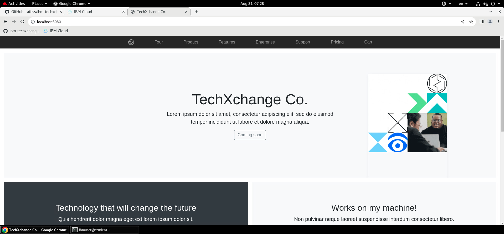

(To close the port-forward, press <kbd>Ctrl</kbd> + <kbd>c</kbd>.)

### Expose company website to the internet

You might remember from the [architecture diagram](#lab-architecture) that there is a network load balancer provisioned in your VPC. This load balancer is accessible from the internet and forwards traffic arriving to `TCP80` and `TCP443` into the nodes of the `public-services-XX` cluster.

The public IP address of this load balancer varies for each lab environment. Find the one belongs to you lab environment in the following table:

|Lab attendee number|Load balancer address|
|-------------------|---------------------|
|01                 |44.214.21.203        |
|02                 |-                    |
|03                 |-                    |
|04                 |-                    |
|05                 |-                    |
|06                 |-                    |
|07                 |54.210.27.68         |
|08                 |44.218.205.0         |
|09                 |-                    |
|10                 |-                    |
|11                 |-                    |
|12                 |-                    |
|13                 |-                    |
|14                 |-                    |
|15                 |-                    |
|16                 |-                    |
|17                 |-                    |
|18                 |-                    |
|19                 |-                    |
|20                 |-                    |

We prepared a custom default domain for your cluster in the following format: `txc-3670-XX.us-south.satellite.appdomain.cloud`.

To see the current configuration of the domain, you can use:

```
ibmcloud oc ingress domain get --cluster public-services-XX --domain txc-3670-XX.us-south.satellite.appdomain.cloud
```

<details>
<summary>Example output</summary>

```
OK

Cluster:            cjo5ulkd009t2f5vk2hg
Domain:             txc-3670-XX.us-south.satellite.appdomain.cloud
Target(s):          10.101.31.228, 10.101.152.230, 10.101.67.119
Provider:           akamai
Default:            yes
Status:             OK
Cert Provider:      lets_encrypt
Secret Name:        txc-3670-01
Secret Namespace:   openshift-ingress
Secret Status:      created
```

</details>

Note that currently private IP addresses are registered (the host addresses). Let's replace the addresses with the public load balancer's IP address:

```
ibmcloud oc ingress domain update --cluster public-services-XX --domain txc-3670-XX.us-south.satellite.appdomain.cloud  --ip <LB_IP>
```

<details>
<summary>Example output</summary>

```
OK
```

</details>

As a last step, you need to create a `Route` configuration to expose the public website using the OpenShift Ingress Controller. Since the `txc-3670-XX.us-south.satellite.appdomain.cloud` custom domain is a wildcard domain, you can use the `public.txc-3670-XX.us-south.satellite.appdomain.cloud` to expose the public website:

```
oc create route edge -n public-website public-website --service public-website --insecure-policy Redirect --hostname public.txc-3670-XX.us-south.satellite.appdomain.cloud
```

<details>
<summary>Example output</summary>

```
route.route.openshift.io/public-website created
```

</details>

The DNS update might take a few minutes, but once the update is completed, you should be able to access _TechXchange Co._'s public website through the `public.txc-3670-XX.us-south.satellite.appdomain.cloud` URL.

Open Google Chrome on the jumpbox again, and visit the https://public.txc-3670-XX.us-south.satellite.appdomain.cloud address. (You can also try opening the site from your mobile device.)

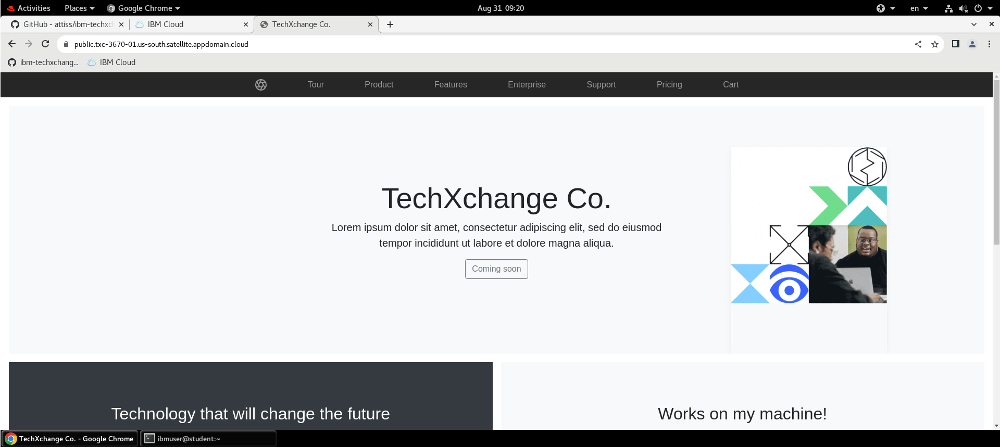

#### Quiz

We managed to open the webpage using HTTPS and the browser evaluates the connection as secure. This is because for every managed domain (`*.satellite.appdomain.cloud` and `*.containers.appdomain.cloud`) IBM Cloud generates a TLS certificates. Who is the issuer of the certificate?

<details>
<summary>Let's Encrypt</summary>
That is correct! :star2:
</details>
<details>
<summary>IBM Cloud CA</summary>
Not exactly. Run the <code>ibmcloud oc ingress domain get --cluster public-services-XX --domain txc-3670-XX.us-south.satellite.appdomain.cloud</code> command again and inspect "Cert Provider" field in the output.
</details>
<details>
<summary>It is a self signed cert, but the browser trusts it</summary>
Not exactly. Run the <code>ibmcloud oc ingress domain get --cluster public-services-XX --domain txc-3670-XX.us-south.satellite.appdomain.cloud</code> command again and inspect "Cert Provider" field in the output.
</details>

## Task 3: Deploy intranet website and expose internally

In this task, you will learn how [Satellite Config](https://cloud.ibm.com/docs/satellite?topic=satellite-cluster-config) is set up to deploy the intranet website of _TechXchange Co._ (our imaginary company) to an OpenShift cluster (`intranet-XX`) deployed on a hybrid-cloud location (`on-prem-location-XX`). You will learn how to manage custom TLS certificates using [IBM Cloud Secrets Manager](https://cloud.ibm.com/docs/secrets-manager?topic=secrets-manager-getting-started) and how to expose an application through private DNS and secure communication with your custom TLS certificate.

### Inspect Satellite Config of your intranet website deployment

With the help of Satellite Config, you can easily and consistently deploy, manage, and control your applications and policies across clusters and locations. In this section you are going to learn how we set up Satellite Config to deploy the intranet website using a GitOps approach. The Kubernetes resources are located in a [public GitHub repository](https://github.com/attiss/ibm-techxchange-2023-3670/blob/main/applications/intranet-website.yaml).

The setup consists of three steps:

1. Creating a configuration that defines the resources to be deployed.
    - For this lab, we created a configuration that watches the `https://github.com/attiss/ibm-techxchange-2023-3670` public GitHub repository.
2. Creating cluster group(s) to deploy the resources to.
    - We created a group of clusters that includes all your `intranet-XX` clusters.
3. Creating subscriptions to associate configuration(s) with cluster group(s).
    - We created a subscription to associate the GitOps configuration with the cluster group.

Here is the overall configuration:

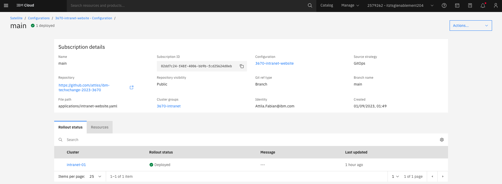

Now, let's check the application. First, fetch the Kubernetes configuration files for the `intranet-XX` cluster:

```bash
ibmcloud oc cluster config --cluster intranet-XX --admin
```

<details>
<summary>Example output</summary>

```
OK
The configuration for intranet-XX was downloaded successfully.

Added context for intranet-XX to the current kubeconfig file.
You can now execute 'kubectl' commands against your cluster. For example, run 'kubectl get nodes'.
```

</details>

Check if the `intranet-website` pods are running in the `intranet-website` namespace:

```bash
oc get pods -n intranet-website
```

<details>
<summary>Example output</summary>

```
NAME                                READY   STATUS    RESTARTS   AGE
intranet-website-5679cf8d56-bk9md   1/1     Running   0          52m
intranet-website-5679cf8d56-cgm8x   1/1     Running   0          52m
intranet-website-5679cf8d56-rbbcw   1/1     Running   0          52m
```

</details>


### Expose intranet website on the company network

_TechXchange Co._'s DNS zone is `txc3670.private`. You are going to expose the intranet site on the `intranet-XX.txc3670.private`. This address has already been created for you and points to the Ingress domain of your `intranet-XX` cluster. Let's validate if the DNS setup is correct.

To see the Ingress domain of your `intranet-XX` cluster, use the following command:

```
ibmcloud oc ingress domain ls --cluster intranet-XX
```

<details>
<summary>Example output</summary>

```
OK
Domain                                                                                 Target(s)                 Default   Provider   Secret Status   Status
intranet-01-e43ebe1e9ac7c5f7ba5fce9d3d1e6c08-0000.us-east.containers.appdomain.cloud   10.241.0.6,10.241.128.5   yes       akamai     created         OK
```

</details>

Try resolving the `intranet-XX.txc3670.private` domain and compare the addresses:

```
dig intranet-XX.txc3670.private
```

<details>
<summary>Example output</summary>

```
; <<>> DiG 9.16.1-Ubuntu <<>> intranet-01.txc3670.private
;; global options: +cmd
;; Got answer:
;; ->>HEADER<<- opcode: QUERY, status: NOERROR, id: 44188
;; flags: qr rd ra; QUERY: 1, ANSWER: 3, AUTHORITY: 0, ADDITIONAL: 0

;; QUESTION SECTION:
;intranet-01.txc3670.private.	IN	A

;; ANSWER SECTION:
intranet-01.txc3670.private. 60	IN	CNAME	intranet-01-e43ebe1e9ac7c5f7ba5fce9d3d1e6c08-0000.us-east.containers.appdomain.cloud.
intranet-01-e43ebe1e9ac7c5f7ba5fce9d3d1e6c08-0000.us-east.containers.appdomain.cloud. 60 IN A 10.241.0.6
intranet-01-e43ebe1e9ac7c5f7ba5fce9d3d1e6c08-0000.us-east.containers.appdomain.cloud. 60 IN A 10.241.128.5

;; Query time: 108 msec
;; SERVER: 161.26.0.7#53(161.26.0.7)
;; WHEN: Thu Aug 31 23:52:33 CEST 2023
;; MSG SIZE  rcvd: 370
```

</details>

All right, the DNS configuration is now verified. The next step is to deploy a TLS certificate that has been issued by _TechXchange Co._'s internal CA. We already generated a certificate for your `intranet-XX.txc3670.private` domain and uploaded it to an IBM Cloud Secrets Manager instance.

Open https://cloud.ibm.com in Google Chrome and log in with the provided credentials.

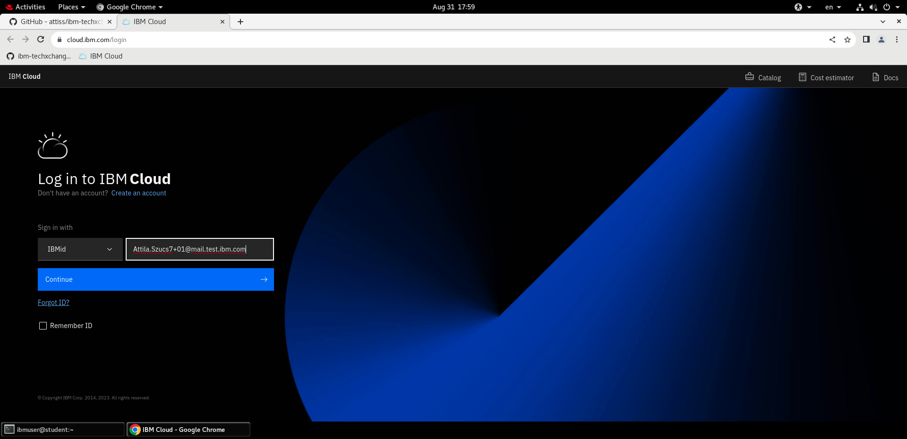
    
Once logged in, select the `2579262 - itztsglenablement204` account in the account selector.

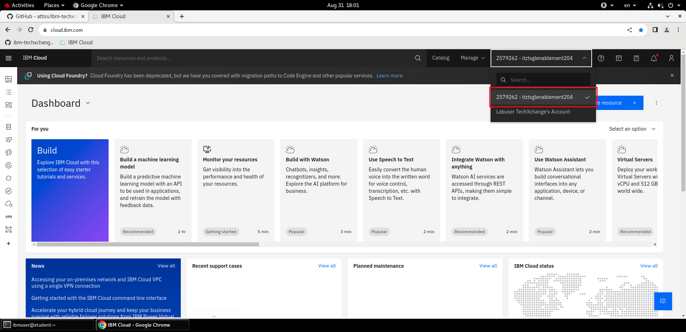

Open the resource list view from the left hand menu, then scroll down to the "Security" section. Open the IBM Cloud Secrets Manager instance named `lab-secrets`.

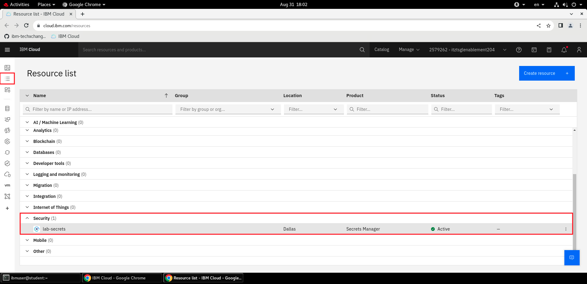

Go to the settings page and copy the instance CRN to the clipboard.

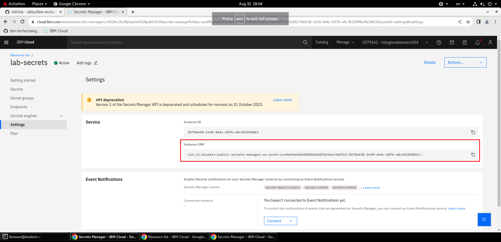

You will need to associate the `lab-secrets` Secrets Manager instance with the `intranet-XX` cluster. Go back to the terminal and run the following command:

```
ibmcloud oc ingress instance register --crn <CRN> --cluster intranet-XX
```

<details>
<summary>Example output</summary>

```
OK
```

</details>

Let's get back to the Secret Manager instance. Select the "Secrets" menu and find your own TLS certificate. Remember, the domain you are going to use is `intranet-XX.txc3670.private`, so look for that in the list.

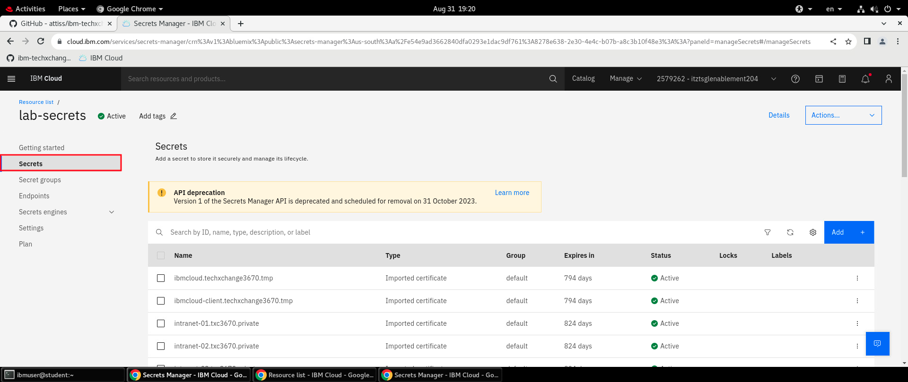

Click on your secret to see its details. Scroll down to the bottom to find the CRN of the secret and copy it to the clipboard.

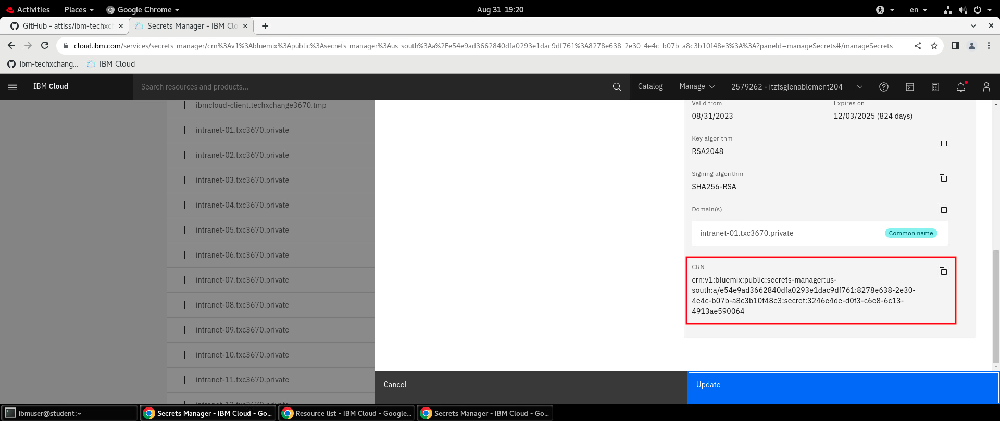

Get back to the terminal and create a Secret resource on the `intranet-XX` cluster using the Secrets Manager secret:

```
ibmcloud oc ingress secret create --name intranet-XX --cluster intranet-XX --namespace intranet-website --cert-crn <CRN>
```

<details>
<summary>Example output</summary>

```
OK
```

</details>

Let's check if the Secret resource is created in the `intranet-website` namespace by executing:

```
oc get secret -n intranet-website intranet-XX
```

<details>
<summary>Example output</summary>

```
NAME          TYPE                DATA   AGE
intranet-XX   kubernetes.io/tls   2      54s
```

</details>

At this point the DNS is verified. The secret with the TLS certificate exists on the cluster. The last step is to expose the intranet website with the OpenShift router. You can create an Ingress resource on the cluster with the appropriate configuration to achieve this.

Create a file using your favorite editor and save it as `ingress.yaml` with the following contents:

```yaml
apiVersion: networking.k8s.io/v1
kind: Ingress
metadata:
  name: intranet-website
  namespace: intranet-website
spec:
  tls:
  - hosts:
    - intranet-XX.txc3670.private
    secretName: intranet-XX
  rules:
  - host: intranet-XX.txc3670.private
    http:
      paths:
      - path: /
        pathType: Prefix
        backend:
          service:
            name: intranet-website
            port:
              number: 8080
```

To create the resource on the cluster, run:

```
oc apply -f ingress.yaml
```

<details>
<summary>Example output</summary>

```
ingress.networking.k8s.io/intranet-website created
```

</details>

It is done! The intranet site should be available on the https://intranet-XX.txc3670.private domain now on the company's internal network. Open it in the browser to verify.

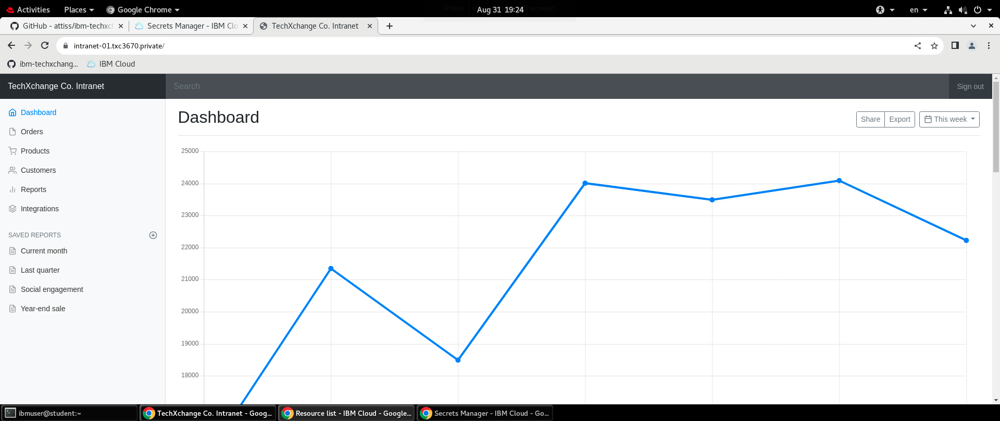

#### Quiz

We managed to open the webpage using HTTPS and the browser evaluates the connection as secure even when using a custom certificate issued by _TechXchange Co._'s private CA. How is this possible?

<details>
<summary>The private CA is an intermediate CA and the certificate chain contains a public trusted CA.</summary>
Not exactly. The certificate chain contains a leaf certificate for <code>intranet-XX.txc3670.private</code> that is signed by the private CA (<code>techxchange3670.tmp</code>).
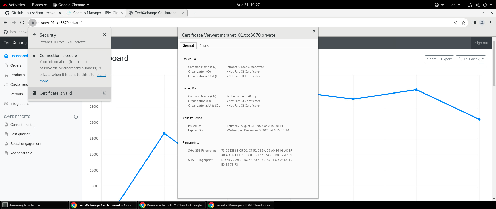
</details>
<details>
<summary>The certificate is trusted worldwide.</summary>
Not exactly. Browsers (and operating systems) usually have a list of trusted CAs that do not include private CAs.
</details>
<details>
<summary>The jumpbox is configured to trust the private CA.</summary>
That is correct! :star2:
</details>

## End of lab

Congratulations on completing this lab! Impressive work!

To recap what you did today:

- You got familiar with IBM Cloud Satellite.
- You learnt how to deploy applications with Satellite Config.
- You exposed applications on your local machine for debugging purposes, publicly to the internet and privately to a secure network.
- You learnt how to manage custom TLS certificates with IBM Cloud Secrets Manager.
